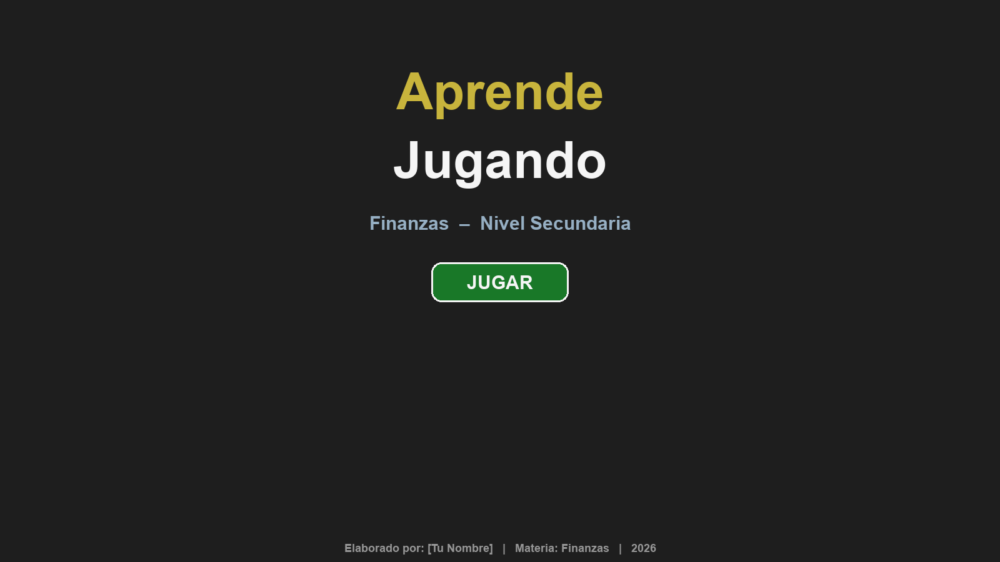
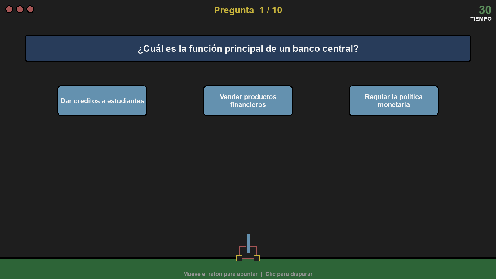

# Aprende Jugando – Finanzas

Juego educativo de preguntas y respuestas sobre finanzas personales y economía, orientado a nivel secundaria. El jugador controla un cañón y dispara hacia el bloque con la respuesta correcta.





## Gameplay

- Se muestra una pregunta en pantalla con 3 opciones de respuesta (bloques).
- Mueve el mouse para apuntar el cañón y haz **clic izquierdo** para disparar.
- Acierta antes de que se acabe el tiempo (30 segundos por pregunta).
- Tienes **3 vidas** — las pierdes por responder mal o dejar pasar el tiempo.
- Completa las 10 preguntas para ganar.

## Requisitos

- Python 3.x
- [pygame](https://www.pygame.org/)

```bash
pip install pygame
```

## Cómo ejecutar

```bash
python main.py
```

## Estructura del proyecto

```
Aprende Jugando/
├── main.py        # Punto de entrada y bucle principal
├── game.py        # Lógica de la partida
├── cannon.py      # Cañón y bala
├── blocks.py      # Bloques de respuesta
├── screens.py     # Pantallas de inicio y fin
├── ui.py          # HUD (vidas, timer, pregunta)
├── questions.py   # Banco de preguntas
├── settings.py    # Constantes (resolución, colores, jugabilidad)
└── tutorial/      # Versión comentada del código para aprendizaje
```

## Agregar preguntas

Edita `questions.py` siguiendo este formato:

```python
{
    "pregunta": "¿Tu pregunta aquí?",
    "opciones": ["Opción A", "Opción B", "Opción C"],
    "correcta": 0  # índice de la opción correcta (0, 1 o 2)
}
```
